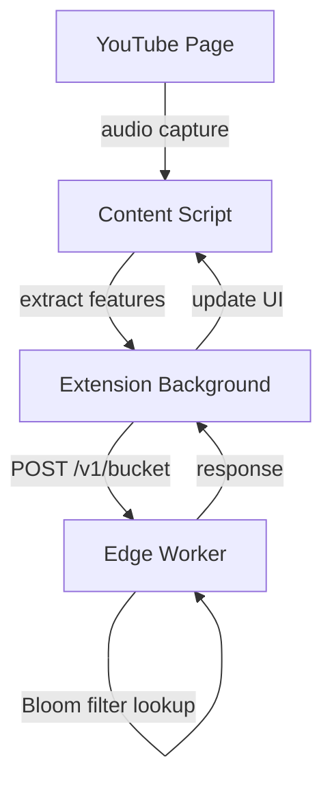

# Data Flow Diagram

```mermaid
flowchart TD
  A[YouTube Page] -->|audio capture| B[Content Script]
  B -->|extract features| C[Extension Background]
  C -->|POST /v1/bucket| D[Edge Worker]
  D -->|Bloom filter lookup| D
  D -->|response| C
  C -->|update UI| B
```

*The diagram is illustrative; actual implementation may differ slightly.*
